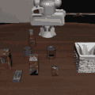

# OpenVLA + LIBERO Practice2

这个仓库用于整理我在 AutoDL 上跑 OpenVLA + LIBERO 推理的结果。

## Demo GIF

### Demo 1: Basic Inference

### Demo 2: High-FPS Mission

> 说明: 这两个 GIF 是为了 README 展示压缩过的版本，对应 `vla_result.mp4` 和 `vla_high_fps.mp4`。

## Repository Structure

- `scripts/final_infer.py`: 基础推理并导出 `vla_result.mp4`
- `scripts/vla_high_fps_mission.py`: 高分辨率/高帧率推理并导出 `vla_high_fps.mp4`
- `assets/vla_result.gif`: README 演示 GIF (Demo 1)
- `assets/vla_high_fps.gif`: README 演示 GIF (Demo 2)

## Quick Start (AutoDL)

1. 准备环境: `Python 3.10 + PyTorch + transformers + LIBERO`
2. 准备模型和数据目录:
   - `MODEL_PATH = /root/autodl-tmp/models/vla-libero-full`
   - `LIBERO_ROOT = /root/autodl-tmp/LIBERO`
3. 运行基础脚本:
   - `python scripts/final_infer.py`
4. 运行高帧率脚本:
   - `python scripts/vla_high_fps_mission.py`

## Notes

- 默认任务是 `libero_10` 的 `task 0`。
- 如需换任务，可在脚本中修改 `task_suite.get_task(...)`。
